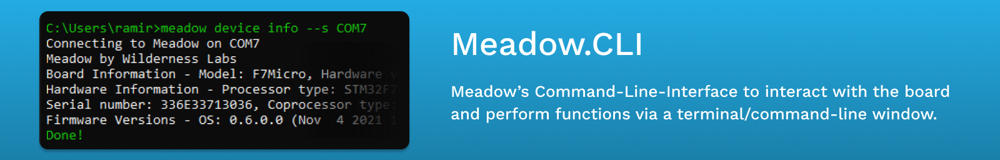

## Build Status
[](https://github.com/WildernessLabs/Meadow.CLI/actions)

## Getting Started

Note: For macOS users, [this line](https://github.com/WildernessLabs/MeadowCLI/blob/master/MeadowCLI/DfuSharp.cs#L29) needs to be changed to `libusb-1.0` TODO: determine OS at runtime or handle fallback

The CLI tool supports DFU flashing for `nuttx.bin` and `nuttx_user.bin`. When the application is run with `-d`, it looks for `nuttx.bin` and `nuttx_user.bin` in the application directory and if not found, it will abort. Optionally, paths for the files can be specific with `--osFile` and `--userFile`.

The CLI tool also supports device and file management including file transfers, flash partitioning, and MCU reset.

To run MeadowCLI on Windows, run meadow.exe from the command prompt. On Mac and Windows, call **mono meadow.exe**.

## Options

To see the options, run the application with the --help arg.

## Running Commands

### Specifying the Serial Port
File and device commands require you to specify the serial port (`-s` or `--SerialPort`). You can determine the serial port name in Windows by viewing the Device Manager. The CLI will remember the last Serial Port used, so you only need to specify it if you need to change the value.

On Mac and Linux, the serial port will show up in the **/dev** folder, generally with the prefix **tty.usb**. You can likely find the serial port name by running the command `ls /dev/tty.usb`.

### Setting the Log Verbosity
Appending `-v` or `-vv` to any command will increase the logging verbosity to `Debug` and `Trace` respectively. `Trace` should only be necessary when debugging issues with the CLI.

### Available Commands
```
meadow v0.13.0

USAGE
  meadow [options]
  meadow [command] [...]

OPTIONS
  -h|--help         Shows help text.
  --version         Shows version information.

COMMANDS
  debug             Debug a Meadow Application
  download os       Downloads the latest Meadow.OS to the host PC.
  install dfu-util  Install the DfuUtil utility
  listen            Listen for console output from Meadow
  trace disable     Disable Trace Logging on the Meadow
  trace enable      Enable trace logging on the Meadow
  trace level       Enable trace logging on the Meadow
  flash erase       Erase the flash on the Meadow Board
  flash verify      Verify the contents of the flash were deleted.
  qspi write        Write a QSPI value to the Meadow
  qspi read         Read a QSPI value from the Meadow
  qspi write        Write a QSPI value to the Meadow
  nsh disable       Disables NSH on the Meadow device.
  nsh enable        Enables NSH on the Meadow device.
  mono disable      Sets mono to NOT run on the Meadow board then resets it.
  mono enable       Sets mono to run on the Meadow board and then resets it.
  mono flash        Uploads the mono runtime file to the Meadow device. Does NOT move it into place.
  mono state        Returns whether or not mono is enabled or disabled on the Meadow device.
  mono update rt    Uploads the mono runtime files to the Meadow device and moves them into place.
  file delete       Delete files from the Meadow File System
  file initial      Get the initial bytes from a file
  file list         List files in the on-board filesystem
  file write        Write files to the Meadow File System
  fs format         Format a File System on the Meadow Board
  fs renew          Create a File System on the Meadow Board
  esp32 restart     Restart the ESP32
  esp32 file write  Write files to the ESP File System
  flash esp         Flash the ESP co-processor
  flash os          Update the OS on the Meadow Board
  device info       Get the device info
  device mac        Read the ESP32's MAC address
  device name       Get the name of the Meadow
  cloud login       Log into the Meadow Service
  cloud logout      Logout of the Meadow Service
  app deploy        Deploy the specified app to the Meadow

You can run `meadow [command] --help` to show help on a specific command.
```

### Getting Help
Specifying `--help` with no command will output the list of available commands. Specifying `--help` with a command (eg: `meadow file delete --help`) will output command specific help.
```
meadow v0.13.0

USAGE
  meadow file delete --files <values...> [options]

DESCRIPTION
  Delete files from the Meadow File System

OPTIONS
* -f|--files        The file(s) to delete from the Meadow Files System
  -s|--SerialPort   Meadow COM port Default: "COM19".
  -g|--LogVerbosity  Log verbosity
  -h|--help         Shows help text.
```

## Useful commands

### Update the Meadow OS
```
meadow flash os
```

### Listen for Meadow Console.WriteLine
```
meadow listen
```

### Set the trace level

You can set the debug trace level to values 0, 1, 2, or 3. 2 is the most useful.
```
meadow trace enable --level 2
```

### File transfers
```
meadow files write -f [NameOfFile]
```
You may specify multiple instances of `-f` to send multiple files

### List files in flash
```
meadow files list
```

### Delete a File

```
meadow files delete -f [NameOfFile]
```
You may specify multiple instances of `-f` to send multiple files

### Stop/start the installed application from running automatically
```
meadow mono disable
meadow mono enable
```
### Useful utilities
```
meadow device info
meadow device name
```

### Debugging
**NOTE THIS IS NOT YET FULLY IMPLEMENTED, IT WILL NOT WORK**
```
meadow debug -s XXXX
```
This starts listening on the specified port for a debugger to attach

Note: you can use SDB command line debugger from https://github.com/mono/sdb. Just build it according to its readme, run the above command and then:

```
sdb "connect 127.0.0.1 XXXX"
``` 
Substitute XXXX for the same port number as above

## Running applications

You'll typically need at least 5 files installed to the Meadow flash to run a Meadow app:

1. System.dll
2. System.Core.dll
3. mscorlib.dll
4. Meadow.Core.dll
5. App.exe (your app)

It's a good idea to disable mono first, copy the files, and then enable mono


## Source Code Quality

This code is ugly. We know. :) Lots of different coding styles, spanning many decades and sensibilities.

# License

Copyright Wilderness Labs Inc.
    
    Licensed under the Apache License, Version 2.0 (the "License");
    you may not use this file except in compliance with the License.
    You may obtain a copy of the License at
    
      http://www.apache.org/licenses/LICENSE-2.0
    
    Unless required by applicable law or agreed to in writing, software
    distributed under the License is distributed on an "AS IS" BASIS,
    WITHOUT WARRANTIES OR CONDITIONS OF ANY KIND, either express or implied.
    See the License for the specific language governing permissions and
    limitations under the License.
